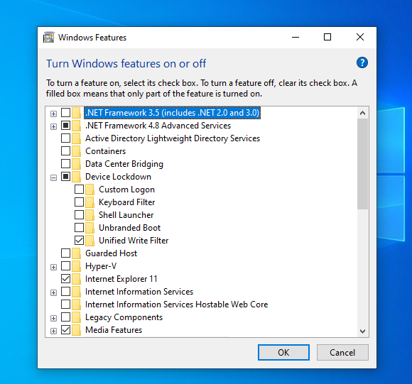

### Pisonet UWF Setup Script

📌 Overview
This script configures Unified Write Filter (UWF) on Windows to make a Pisonet system work like Deep Freeze.
Every reboot resets the computer to a clean state, while still allowing games and browsers to update normally.

---

## ⚠️ Important Requirements

- ✅ Works only on **Windows 10/11 Enterprise LTSC** or **Windows 10/11 Education LTSC**.  
- ❌ **Not supported** on Windows Home, Pro, or standard Enterprise/Education editions.  
- Must be run as **Administrator**.  

---

## TURN WINDOWS FEATURES ON or OFF
Device Lockdown -> Unified Write Filter (✅) \



## AFTER ENABLE/TURN ON
You can test the config
```powershell
uwfmgr get-config
uwfmgr help

uwfmgr filter help
uwfmgr file help
uwfmgr volume help
```

```powershell
# filter
uwfmgr filter enable
uwfmgr filter disable

# file
uwfmgr file add-exclusion <PATH> # Path file or directory
uwfmgr file remove-exclusion <PATH> # Path file or directory

# volume
uwfmgr volume protect C: # protect volume C:
uwfmgr volume unprotect C: # remove protection volume C:

```

📂 Exclusions
   The script excludes the following folders so updates are not lost:

   - C:\Games – custom game folder

   - C:\Users\Hairyblue\AppData\Local\Roblox

   - C:\Program Files (x86)\Roblox and C:\Users\Public\Roblox – Roblox client (optional)

   - C:\Program Files (x86)\Steam – Steam client

   - C:\Program Files\Epic Games – Epic Games launcher

   - C:\Riot Games – Riot Games (Valorant, League of Legends)
   
   - C:\Program Files\Google\Chrome and C:\Program Files (x86)\Google\Chrome – Chrome updates

   - C:\Program Files\Microsoft\Edge and C:\Program Files (x86)\Microsoft\Edge and  – Edge updates

   - C:\Program Files\Mozilla Firefox – Firefox updates

   - C:\Windows\SoftwareDistribution – Windows Update files (optional)

⚠️ User data is not excluded. This means all browser history, passwords, Roblox login credentials, and other personal files are wiped at reboot.

🚀 Usage
For safety I recommend manually do paste the script from: .
```
setup-uwf-pisonet.md
```

OR

Save the script as `setup-uwf-pisonet.ps1.`
Run PowerShell as Administrator.
Execute:
```powershell
Set-ExecutionPolicy Bypass -Scope Process -Force
.\setup-uwf-pisonet.ps1
```

PC will reboot and UWF will be active.
🔄 After Reboot
Games update normally.
Browsers update but do not keep customer logins.
Roblox requires login every time.
Any personal changes made by customers are erased automatically.


`Set-ExecutionPolicy Bypass -Scope Process -Force` is a PowerShell command that temporarily changes the rules for running scripts.
🔍 Parts explained:

`Set-ExecutionPolicy`
This controls what kind of PowerShell scripts are allowed to run on your system. By default, Windows blocks downloaded scripts for safety.

`Bypass`
This tells PowerShell:
“Ignore script blocking, run it anyway without warnings.”
It’s temporary — does not change the permanent settings.

`-Scope Process`
This limits the change to the current PowerShell session only.
Once you close the window, the execution policy goes back to normal.
This avoids permanent security risks.

`-Force`
Skips asking for confirmation (otherwise it would ask “Are you sure?”).


⚠️ **Disclaimer:**  
This script is provided **for testing purposes only**.  
It is intended for **Pisonet use cases** to see how Unified Write Filter (UWF) can help reset PCs after every reboot.  
I am **not an expert** in this field. Use at your own risk — misconfiguration may cause apps or Windows updates to stop working properly.  
Do **not** use in production environments without proper IT knowledge.

---

thanks gpt...